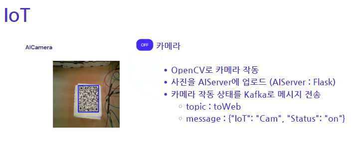
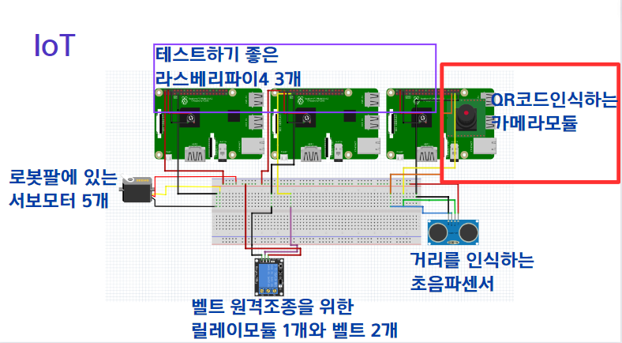

## 🤹🏻 기술 스택 선정 이유
```sh
- 라즈베리파이 : 작고 가벼움
- 파이썬 : 장비 기동을 위한 코드 
- kafka : 장비상태메시지 전달
``````
## 🔍 Overview

### 📸1. 실시간 AI 카메라 모니터링 및 제어

🎬[클릭해서 유튜브로 이동](https://www.youtube.com/watch?v=YpPmn7hPwsQ) 


```sh
yolo5 AI가 탑재된 RasberryPi 카메라 모듈로 
상품의 QR코드를 인식한 후 
로봇팔이 기동하여 물류상자를 다른 벨트로 옮긴다.
``````
### 💻2. 카메라 구동방식

<center>
    
</center>

```sh
카프카로 상태메시지를 전달하여 카메라를 제어
``````
<br>

### 💻3. 카메라 구동방식

<center>
    
</center>

<br>

### 🔧4. IOT 보드 설계

<center>
    
</center>

```sh
fizing을 사용하여 보드설계
``````
<br>


### 🔧5. 로봇팔 기동

<center>
    
</center>

```sh
라즈베리파이 내의 파이썬 코드로 기동
``````
<br>

